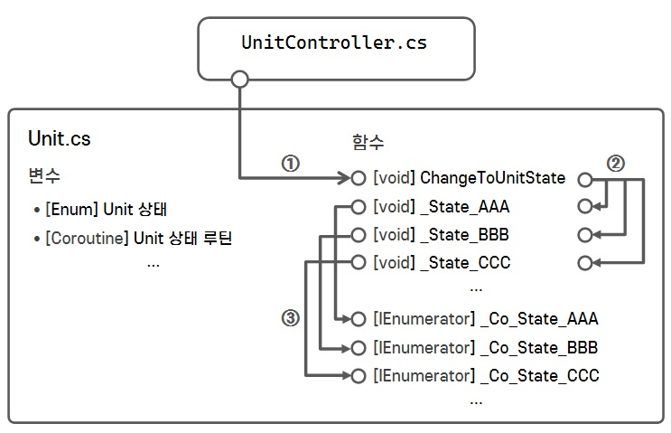

# StateMachine

**[StateMachine Repository]에는 2가지의 [StateMachine]이 구현되어있습니다.**

- StateMachine Version 1.0.0
- StateMachine Version 2.0.0

## StateMachine Version 1

### 설계 구조

### 설계 의도

- 캐릭터(Unit)의 움직임과 같이 볼륨이 적은 상태(State)만 관리를 목적.
- 상태(State)를 직접적으로 직접적으로 수정 불가.
- 외부에서 캐릭터(Unit)의 상태(State) 변경은 함수로만 가능.
- 상태(State)에 따라 각자 기능을 추상화.
- 상태(Stae) 변경 시, 이전 상태 기능을 무력화.

### 코드 공유

<pre>
  <code>
    // --------------------------------------------------
    // Unit State Enum
    // --------------------------------------------------
    public enum EUnitState
    {
        Unknown = 0,
        State_A = 1,
        State_B = 2,
        State_C = 3,
    }
    
    // --------------------------------------------------
    // Functions - Nomal
    // --------------------------------------------------
    // ----- Public
    public void ChangeToUnitState(EUnitState unitState, Action doneCallBack = null) 
        => _ChangeToUnitState(unitState, doneCallBack);
    
    // ----- Private
    private void _ChangeToUnitState(EUnitState unitState, Action doneCallBack)
    {
        if (!Enum.IsDefined(typeof(EUnitState), unitState))
        {
            Debug.LogError($"<color=#FF0000>[Unit._ChangeToUnitState] {Enum.GetName(typeof(EUnitState), unitState)}은 정의되어있지 않은 Enum 값입니다.</color>");
            return;
        }
    
        if (_unitState == unitState)
            return;
    
        _unitState = unitState;
    
        if (_co_CurrentState != null)
            StopCoroutine(_co_CurrentState);
    
        switch (_unitState)
        {
            case EStateType.State_A: _State_State_A(); break;
            case EStateType.State_B: _State_State_B(); break;
            case EStateType.State_C: _State_State_C(); break;
        }
    }
    
    private void _State_State_A(Action doneCallBack) 
        => _co_CurrentState = StartCoroutine(_Co_State_A(doneCallBack));
        
    private void _State_State_B(Action doneCallBack) 
        => _co_CurrentState = StartCoroutine(_Co_State_B(doneCallBack));
    
    private void _State_State_C(Action doneCallBack) 
        => _co_CurrentState = StartCoroutine(_Co_State_C(doneCallBack));
    
    // --------------------------------------------------
    // Functions - State Coroutine
    // --------------------------------------------------
    private IEnumerator _Co_State_A(Action doneCallBack)
    {
        // [TODO] 상태(State)에 따른 초기화 
    
        while (_unitState == EMoveType.Idle_Empty)
        {
            // [TODO] 상태(State) 반복 기능
            
            yield return null;
        }
    
        doneCallBack?.Invoke(); // [TODO] 정상적인 상태 종료 시, 콜백함수 실행
    }  
    ... // 다른 상태(State) 함수도 동일하게 작동
  </code>
</pre>
