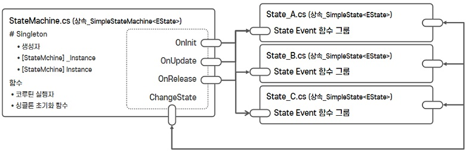

# StateMachine Version 2.0

### 설계 구조
 

### 설계 의도

- 게임 플로우와 **같이 볼륨이 많은 상태(State)만 관리를 목적**.
- 상태(State)를 직접적으로 직접적으로 수정 불가.
- 볼륨이 큰 작업을 수행할 것이므로 **상태(State)를 함수가 아닌 클래스로 관리**.
- StateMachine을 Manage 클래스(Static)로 **각 상태(State)를 접근할 수 있는 유일한 SingleTon 타입를 적용**.
- 여러개의 상태(State)가 동작하지 않도록 다른 상태 기능 무력화.
- 각 상태(State)가 클래스로 관리되기 때문에 **상태(State)가 많아질 수록 Mono의 상속(Coroutine 사용 등)이 많아질 수 있으므로, 관리 할 수 있는 Coroutine 실행자를 1개만 사용**.

### 코드 공유

